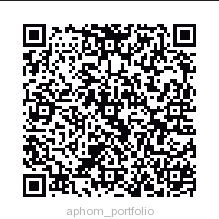

# Athena Phommivong's Portfolio Project

*This project is made possible by following the template from : https://redpixelthemes.com/templates/atom/*

This is an online portfolio that I created for my BAIS:3300 class at the University of Iowa. I have utilized all of the subjects that I've learned from that class to make this website, and have properly uploaded it for everyone to view!

Scan this QR Code to see my web portfolio!

Alternatively, here is the official link to site : https://athenaphommivong.com
